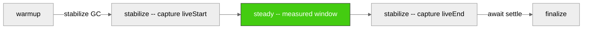
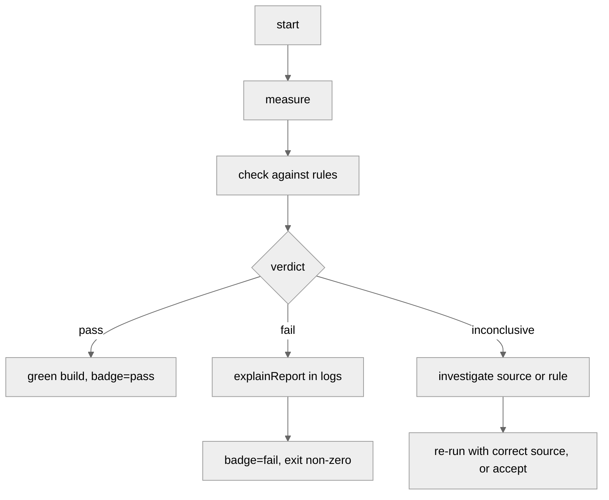

# Cookbook

The README is a reference. It answers *what does this API do?*

This is the cookbook. It answers *how do I use it for X?*

Recipes are graded in four tiers:

- **Start here (0)** -- you have installed the package and want to see a
  number, before deciding anything gates.
- **Basics (1-5)** -- your first gate, picking a lane, choosing a
  threshold, reading a verdict, wiring it into CI.
- **Working (6-14)** -- comparing against a control, locking a baseline,
  narrating failures, render loops, worker heaps, allocator hunts, and
  getting the result into a CI log a human will read.
- **Pro (15-18)** -- what to do when a threshold that passes on your
  laptop fails on the runner, how to triage `inconclusive` instead of
  suppressing it, and how to gate when no absolute number is portable.

Read them in order if you are new; jump around if you know what you are
looking for.

Each recipe has the same shape:

- **Goal** -- what you are trying to prove.
- **Primitive** -- which entry point.
- **Code** -- the smallest correct usage.
- **Reading the verdict** -- what each field of the report actually
  means for your goal.
- **Gotchas** -- the traps I fell in first.

Everything below assumes you have run `npm i @zakkster/lite-gc-profiler`
and that your test process starts with `node --expose-gc`. If you have
not read the README, this cookbook will still work; you will get more
out of it if you have.

## Contents

**Diagrams**

- [The phase timeline](#the-phase-timeline)
- [The source verifiability matrix](#the-source-verifiability-matrix)
- [The CI workflow](#the-ci-workflow)

**Recipes**

0. [Just show me a number](#recipe-0-just-show-me-a-number)
1. [My first gate](#recipe-1-my-first-gate)
2. [Picking a lane](#recipe-2-picking-a-lane)
3. [Setting a threshold you can defend](#recipe-3-setting-a-threshold-you-can-defend)
4. [Reading a verdict correctly](#recipe-4-reading-a-verdict-correctly)
5. [Adding a gate to CI](#recipe-5-adding-a-gate-to-ci)
6. [Comparing against a control](#recipe-6-comparing-against-a-control)
7. [Baseline lock: capture once, gate forever](#recipe-7-baseline-lock-capture-once-gate-forever)
8. [Explaining a failure](#recipe-8-explaining-a-failure)
9. [Gating across worker threads](#recipe-9-gating-across-worker-threads)
10. [Explain mode: finding the allocator](#recipe-10-explain-mode-finding-the-allocator)
11. [Gating a render loop](#recipe-11-gating-a-render-loop)
12. [Aggregating worker threads](#recipe-12-aggregating-worker-threads)
13. [Aggregating render loops across contexts](#recipe-13-aggregating-render-loops-across-contexts)
14. [Getting the failure into your CI log](#recipe-14-getting-the-failure-into-your-ci-log)
15. [Pro: thresholds that survive a different machine](#recipe-15-pro-thresholds-that-survive-a-different-machine)
16. [Pro: triaging inconclusive instead of suppressing it](#recipe-16-pro-triaging-inconclusive-instead-of-suppressing-it)
17. [Pro: gating when no absolute number is portable](#recipe-17-pro-gating-when-no-absolute-number-is-portable)
18. [Flaky workloads: gating across repetitions](#recipe-18-flaky-workloads----gating-across-repetitions)

**CLI**

- [Running lite-gc-gate directly](#cli-running-lite-gc-gate-directly)
- [Handling inconclusive verdicts in CI](#cli-handling-inconclusive-verdicts-in-ci)

---

## Diagrams

### The phase timeline

A `stabilize:true` measurement is not one continuous window. It is four
phases with two forced-GC anchors between them. Warmup allocations do
not count against steady gates because the anchor sits between them.



`bytesPerOp = (liveEnd - liveStart) / ops`. The two forced GCs give you
the compacted live-set delta -- retention, not transient churn. On sync
`measureOps`, `stabilize:true` is opt-in. On `measureFrames` and
`measureOpsAsync`, it is on by default when `globalThis.gc` is available,
because those lanes are already async and the marginal cost of two GCs
at boundaries is negligible.

### The source verifiability matrix

Not every rule can be checked on every runtime. Node has precise GC
events via `perf_hooks`, Chrome has a heap-drop heuristic, cross-origin
isolated pages have `measureUserAgentSpecificMemory`, everywhere else
has frame anomalies. The matrix decides.

| rule | `gc` (Node) | `heap` (Chrome) | `uasm` (Chrome+coop) | `none` |
| --- | --- | --- | --- | --- |
| `maxBytesPerOp` | needsHeap | needsHeap | needsUasm | no |
| `maxBytesPerFrame` | needsHeap | needsHeap | needsUasm | no |
| `maxMajorsPerKOp` | yes | no | no | no |
| `maxMinorsPerKOp` | yes | no | no | no |
| `maxPauseMsPerOp` | yes | no | no | no |
| `maxDroppedFrames` | **yes** | **yes** | **yes** | **yes** |

`maxDroppedFrames` is the one row that works everywhere -- work-time is
measured directly from `performance.now()`, no memory channel required.
The rest gate on `inconclusive`, not `pass`, if the source can't verify.

### The CI workflow

Measurement is the middle of a longer flow. The failure path matters
more than the pass path.



The failure path leaves you evidence. Never bypass it with
`allowInconclusive` unless you know why the run can't verify.

---

## Recipe 0: Just show me a number

**Goal.** See what a function actually retains, before deciding anything
about budgets. Gating is the second thing you do, not the first.

**Primitive.** `measureOps`. It measures and returns; it never throws a
budget error, because you have not set a budget.

**Code.**

```js
// save as probe.mjs, run with:  node --expose-gc probe.mjs
import { measureOps } from '@zakkster/lite-gc-profiler';

const kept = [];

const leaky = (i) => { kept.push({ id: i }); };   // retains one object per call
const clean = (i) => i * 2;                       // retains nothing

console.log('leaky:', measureOps(leaky, { ops: 10_000, warmup: 500, stabilize: true }).bytesPerOp);
console.log('clean:', measureOps(clean, { ops: 10_000, warmup: 500, stabilize: true }).bytesPerOp);
```

Roughly what you should see:

```
leaky: 43.5
clean: 0.2
```

Your exact numbers will differ -- that is the point of Recipe 15 -- but
the shape holds everywhere: tens of bytes for the leak, essentially zero
for the clean function.

**Reading the verdict.** There is no verdict here -- that is the point.
`bytesPerOp` is bytes *retained* per call, measured as the difference in
the live heap between two forced garbage collections. It is not bytes
allocated. A function that allocates a megabyte per call and drops it
all reads approximately zero, and that is correct: transient garbage is
not a leak, and the collector's whole job is to make it free.

Two numbers, two lessons. `leaky` at ~41 B/op is one small object per
call surviving collection -- the smallest realistic leak there is.
`clean` at 0 is what "retains nothing" looks like. Everything else in
this cookbook is about turning that gap into something CI can act on.

**Gotchas.**

- Without `--expose-gc`, `stabilize: true` throws at setup instead of
  quietly falling back to a noisier measurement. If you asked for the
  anchored path you get it or an error, never a worse number wearing the
  same name.
- Run it twice. The two readings should be close. If `clean` is not
  near zero, your "clean" function is retaining something -- a closure,
  a console reference, an array you forgot -- and finding out now is
  cheaper than finding out through a failing gate later.
- Do not compare `bytesPerOp` across machines yet. The same object can
  measure ~1.7 KB on one build and ~340 bytes on another, because
  pointer compression changes how wide a tagged slot is. Recipe 15 is
  entirely about this.

---

## Recipe 1: My first gate

**Goal.** Prove that one call into my hot path retains under N bytes.

**Primitive.** `assertOps` with `stabilize: true`.

**Code.**

```js
import { assertOps } from '@zakkster/lite-gc-profiler';

function signalSet(i) {
    // your hot path
    mySignal.set(i);
}

assertOps(signalSet,
    { maxBytesPerOp: 5 },
    { ops: 10_000, warmup: 500, stabilize: true }
);
```

Run under `node --expose-gc`. If the hot path retains under 5 bytes per
call, the function returns a report. If it retains more, it throws
`GcBudgetError`. If the source cannot verify -- browser without a heap
channel, `source: 'none'` -- it throws `GcInconclusiveError`.

**Reading the verdict.** The successful report shape from sync `checkOps`:

```js
{
    kind: 'ops',
    verdict: 'pass',
    checked: { maxBytesPerOp: true },
    violations: [],
    ok: true,                                      // v1.0.0-shape convenience
    ops: 10000,
    opsPerSec: 15234000,
    bytesPerOp: 0.8,                               // your measured retention rate
    source: 'gc',
    summary: { /* GcSummary tree */ }
}
```

`bytesPerOp: 0.8` means the workload retained under one byte per call.
That is the number your CI should compare against next time.
`checked: { maxBytesPerOp: true }` means the rule actually enforced
something -- it did not silently skip because the source couldn't
observe.

The sync ops lane exposes only `bytesPerOp` as a rule. There is no
`bytesPerOpStable` field on this path -- the sync primitive does not
distinguish between the stabilised and raw two-point paths at the API
level. Use `measureOpsAsync` (Recipe 3) if you need that flag; that
lane returns `bytesPerOpStable` in the result and its `checkOpsAsync`
report wraps the measurement in `report.result`.

**Gotchas.**

- Without `--expose-gc`, `stabilize: true` throws at setup rather than
  silently downgrading. That is intended: if you asked for the
  stabilised path, you get it or an error, never a false pass on the
  noisier raw two-point delta.
- `ops: 10_000` is a reasonable default for a signal setter. A workload
  that takes a millisecond per op should use `ops: 100` and a longer
  wall-clock budget.
- `warmup: 500` matters. V8 does not tier-optimise your hot path on the
  first call; the first hundred iterations of the steady phase would
  otherwise be the JIT tiering up, not the workload you meant to
  measure.

---

## Recipe 2: Picking a lane

**Goal.** Know which primitive to reach for.

The library has four measurement lanes. They measure different things.
Pick the one whose *shape* matches your workload.

| your workload | primitive | schema |
| --- | --- | --- |
| synchronous hot path, tight loop | `measureOps` | `lite-gc-ops/1` |
| async hot path, awaits between calls | `measureOpsAsync` | `lite-gc-ops-async/1` |
| render loop, work per frame, frame budget | `measureFrames` | `lite-gc-frames/1` |
| whole-window observation, no per-op or per-frame accounting | `assertNoGc` / `checkNoGc` | `lite-gc-report/1` |

Rules of thumb:

- **Solid.js signals**, **Preact Signals sync path**, **any function
  that returns synchronously** -- `measureOps`.
- **Vue reactivity effects**, **Svelte 5 runes**, **Preact Signals
  batched effects**, **any function that awaits its own work** --
  `measureOpsAsync`.
- **Anything on a scheduler**: canvas render loops, DOM commit phases,
  particle systems, physics ticks -- `measureFrames`.
- **A whole request/response cycle**, **a fixture-driven simulation**,
  or **the "does anything major happen here at all" question** --
  `assertNoGc`.

The three per-op / per-frame lanes cover the "hot path" question at
different granularities. `assertNoGc` covers the "does this window
allocate anything measurable" question.

**Gotcha.** `measureOps` is *sync*. `PerformanceObserver` -- the
mechanism Node uses to hear GC events -- delivers on event-loop turns.
A sync loop never yields, so `result.summary.phases.steady.gc.major`
reads zero even under heavy churn. This is honest ("the observer saw
nothing"), not misleading ("the workload was clean"). The ops lane
exposes only `bytesPerOp` as a rule for exactly this reason -- memory
readings do not require an observer turn. If you need GC-event counts
under real churn, use `measureOpsAsync` (every `await` yields) or
`measureFrames` (the scheduler yields between frames).

---

## Recipe 3: Setting a threshold you can defend

**Goal.** Pick a `maxBytesPerOp` number that will not have to change
next month.

The wrong way is to guess `{ maxBytesPerOp: 10 }` because 10 sounds
tight. Ten what -- ten bytes of what, on which V8 build? Retained
object sizes vary. A plain object of 30 keys is ~1.7 KB on one V8
build, ~340 bytes on another (pointer compression, header layout,
V8 version). A threshold that passes CI on your laptop fails on the
runner. Not flaky. Wrong.

The right way is two lines:

```js
// 1) Measure the clean floor on THIS machine.
const clean = await measureOpsAsync(cleanFn, { ops: 10_000, warmup: 500 });
const floor = Math.max(clean.bytesPerOp, 32);        // guard against zero

// 2) Gate a candidate relative to the floor.
await assertOpsAsync(candidateFn,
    { maxBytesPerOp: floor * 4 },
    { ops: 10_000, warmup: 500 }
);
```

`floor * 4` is four times the noise floor you measured on this
machine. On a stabilised path (`stabilize: true` on the async lanes,
by default under `--expose-gc`) the clean floor is close to zero, and
a real leak reads its true rate. A 4x multiplier is comfortable
headroom against V8 build variance without being permissive.

For **portable test payloads** in torture-style pins, prefer
`new Array(1024).fill(i)` over plain objects. Fixed-size typed-array
slots are heap-visible with predictable size on every V8 build; plain
objects are not.

**Gotcha.** `compareOps` and `compareOpsAsync` delta rules under
`Promise.all` cannot be trusted -- as of v1.5.1 they now throw at
setup, because two measurements running concurrently silently
contaminate each other's readings on the shared heap. Use them
sequentially, which is what `compareOps` does internally anyway.

---

## Recipe 4: Reading a verdict correctly

**Goal.** Understand what each field of the report actually tells you.

There are three verdicts. All three are informative. None of them
means "definitely OK to ship."

**`pass`** -- the actual metric was under the limit AND the source
could verify the rule. `checked[rule] === true`. This is the only
verdict that lets a build stay green.

**`fail`** -- the metric was over the limit. `violations` contains
`{ rule, metric, actual, limit }` for each rule that failed. The
number that matters is not `actual` alone; it is `actual - limit` and
the ratio `actual / limit`. `explainReport` computes both.

**`inconclusive`** -- the source could not verify at least one rule.
`checked[rule] === false` for the rules that could not be checked.
This is a real answer, not a soft failure. It usually means:

- The runtime does not expose a heap channel (`source: 'none'`), so
  `maxBytesPerOp` cannot be enforced. Fix: run under Node or Chrome, or
  drop the rule.
- The measurement produced a non-finite metric (`NaN`, `Infinity`), so
  the comparison would silently pass everything. Fix: investigate the
  source, do not use `allowInconclusive`.
- Comparing across mixed sources in an aggregate. Fix: run all
  contexts on the same explicit source.

Two more fields matter for interpretation:

**`bytesPerOpStable`** (async ops) / **`bytesPerFrameStable`** (frames)
-- `true` means the stabilised live-set-delta path ran (retention, not
noise). `false` means the raw two-point delta ran (higher noise floor,
readings can be off by 1000 B/frame or more).

**`asyncResidual`** (async ops, frames) -- bytes the heap grew AFTER
`gc.settle()`. Non-zero means the workload spawned work that outlived
the measurement window -- a fire-and-forget microtask, a background
timer. Not a gate rule; a smoke signal. If you wrote a hot path that
expects to be synchronous, non-zero here means you missed an `await`.

`explainReport` narrates all of this. Recipe 8 shows it in use.

---

## Recipe 5: Adding a gate to CI

**Goal.** Fail my build on a retention regression.

The minimum GitHub Actions workflow:

```yaml
name: gc-gate
on: [push, pull_request]

jobs:
  gate:
    runs-on: ubuntu-latest
    steps:
      - uses: actions/checkout@v4
      - uses: actions/setup-node@v4
        with: { node-version: '20' }
      - run: npm ci
      - run: node --expose-gc test/gc-gate.mjs
```

The gate script (`test/gc-gate.mjs`):

```js
import { assertOps } from '@zakkster/lite-gc-profiler';
import { explainReport, gateBadge } from '@zakkster/lite-gc-profiler/explain';
import { writeFileSync } from 'node:fs';
import { hotPath } from '../src/index.js';

try {
    const report = assertOps(hotPath,
        { maxBytesPerOp: 5 },
        { ops: 10_000, warmup: 500, stabilize: true }
    );
    writeFileSync('gc-badge.json',
        gateBadge(report, { format: 'shields-json' }));
} catch (err) {
    console.error(explainReport(err.report, { colour: true }));
    if (err.report) {
        writeFileSync('gc-badge.json',
            gateBadge(err.report, { format: 'shields-json' }));
    }
    process.exit(1);
}
```

The badge JSON drives a live shields.io badge in your README:

```md

```

**Gotchas.**

- `--expose-gc` is required. Without it, `stabilize: true` throws and
  the gate never runs.
- Set `EXPECTED_VERSION` in your baseline test as well; a drift on the
  library version can silently change semantics.
- `process.exit(1)` runs after the catch block; do not put it inside
  `finally` unless you want to swallow the error.
- The badge JSON is written both on success (green) and on failure
  (red). Serve it from the same URL; a stale badge is worse than no
  badge.

---

## Recipe 6: Comparing against a control

**Goal.** Prove that my new implementation does not retain more than
the old one.

The wrong way is to gate the new implementation against a hard
`maxBytesPerOp` number. That number will drift with V8 versions and
with unrelated refactors. The right way is to compare the two
implementations against each other under identical conditions on the
same machine and gate the delta.

```js
import { assertCompareOpsAsync } from '@zakkster/lite-gc-profiler';
import { oldImpl, newImpl } from '../src/index.js';

await assertCompareOpsAsync(oldImpl, newImpl,
    { maxExtraBytesPerOp: 0 },                     // the new must not retain more
    { ops: 10_000, warmup: 500, stabilize: true }
);
```

`{ maxExtraBytesPerOp: 0 }` says: the new implementation may not
retain more bytes per op than the old one, at all. If it does, the
gate throws with a report that includes both `control.bytesPerOp` and
`candidate.bytesPerOp`, so the diff is obvious.

Softer thresholds are fine for exploratory work:
`{ maxExtraBytesPerOp: 8 }` allows the new implementation to retain up
to 8 extra bytes per op -- useful during a refactor where you want to
catch a doubling but not a marginal drift.

**Gotchas.**

- `stabilize: true` is required for a delta gate to be trustworthy.
  Without it, both readings sit on multi-KB/op cold-start noise; the
  delta is noise-of-noise, and a `maxExtraBytesPerOp: 1024` gate
  passes everything.
- Both functions must be *serialisable to the same measurement*. Old
  and new must be called with the same `i`, in the same environment,
  on the same warmup. `compareOps` does that; do not roll your own.
- The convenience form (two functions) runs them *sequentially* on the
  shared heap. Never parallel. Since v1.5.1, parallel runs throw at
  setup rather than silently contaminating each other.

---

## Recipe 7: Baseline lock: capture once, gate forever

**Goal.** Freeze a known-good distribution and gate every future run
against it.

Threshold gates guard absolute values. Baseline gates guard
distributions. Same idea as a golden-master test, adapted for
statistical readings.

Baseline gating is a **whole-window** concern -- it gates on the GC
summary a `GcProfiler` records over an entire measurement window, not
on a per-op or per-frame rate. Use this for the "is anything major
happening at all in this workload" question, not for "what's the
retention per signal setter."

**Step 1: capture the baseline** (once, on a known-good build).

```js
import { GcProfiler, aggregateGc, createBaseline, captureFingerprint } from '@zakkster/lite-gc-profiler';
import { writeFileSync } from 'node:fs';

// Run the workload N times, collect the summaries.
const summaries = [];
for (let i = 0; i < 5; i++) {
    const gc = new GcProfiler().start();
    await runHotPathWorkload();                    // your workload here
    await gc.settle();
    summaries.push(gc.summary());
    gc.stop();
}

const aggregate = aggregateGc(summaries);
const baseline = createBaseline(aggregate);
baseline.fingerprint = captureFingerprint();       // node version, arch, cpu

writeFileSync('gc-baseline.json', JSON.stringify(baseline, null, 2));
```

Commit `gc-baseline.json` to your repo. It records the distribution's
median, max, and jitter for each GC metric.

**Step 2: gate every future run.**

```js
import { GcProfiler, aggregateGc, assertAgainstBaseline } from '@zakkster/lite-gc-profiler';
import { readFileSync } from 'node:fs';

const baseline = JSON.parse(readFileSync('gc-baseline.json', 'utf8'));

const summaries = [];
for (let i = 0; i < 3; i++) {
    const gc = new GcProfiler().start();
    await runHotPathWorkload();
    await gc.settle();
    summaries.push(gc.summary());
    gc.stop();
}

assertAgainstBaseline(aggregateGc(summaries), baseline);
```

`assertAgainstBaseline` gates on the baseline's `max` per metric, not
its `median`. A run whose median is worse than the baseline's max
fails. A run that lands within the baseline's own historical spread
passes.

**The CLI shorthand.** The whole capture-then-gate flow is one command:

```
# capture on the good build
npx lite-gc-gate run test/gc-window.mjs --reps 5 --baseline gc-baseline.json --update-baseline

# every future run
npx lite-gc-gate run test/gc-window.mjs --reps 3 --baseline gc-baseline.json
```

Where `test/gc-window.mjs` is a target script that runs your workload
once (the CLI's `--reps` handles the repetition and aggregation).

**Gotchas.**

- **A baseline that cannot verify anything is `inconclusive`, not
  `pass`.** As of v1.5.2, a comparison counts only when both the
  current aggregate and the baseline have finite values for a metric.
  A truncated baseline (missing groups, schema drift) yields
  `inconclusive` with `reason: 'no_comparable_metrics'`. Regenerate
  the baseline rather than reaching for `allowInconclusive`.
- **Regenerate the baseline on major V8 changes.** A stale baseline is
  a soft green build. Move it deliberately, not accidentally.
- **Fingerprint mismatches** (different Node major, different CPU
  arch) yield `inconclusive` by default. Pass
  `--accept-fingerprint-mismatch` (CLI) or the equivalent option on
  the programmatic API only when you know the drift is legitimate.
- **The per-op / per-frame lanes do not have first-class baseline
  support** in this batch. For those, capture the clean floor on the
  known-good build, store it as a hard-coded threshold, and gate
  against it. Recipe 3.

---

## Recipe 8: Explaining a failure

**Goal.** Turn a `verdict: 'fail'` object into a CI log line a human
can act on.

The failure is not the report. The failure is what CI shows you.

```js
import { assertOpsAsync, GcBudgetError } from '@zakkster/lite-gc-profiler';
import { explainReport } from '@zakkster/lite-gc-profiler/explain';

try {
    await assertOpsAsync(hotPath,
        { maxBytesPerOp: 5 },
        { ops: 10_000, warmup: 500 });
} catch (err) {
    if (err instanceof GcBudgetError) {
        console.error(explainReport(err.report, { colour: true }));
    }
    throw err;
}
```

The output shape:

```
gc-gate: FAIL -- ops-async

Violations (1):
  maxBytesPerOp
    actual: 47.20
    limit:  5 (+42.20; +844.00% over limit)
    means:  bytes per op

Run:
  ops:     10000
  warmup:  500
  source:  gc
  stabilized: yes
```

`stabilized: yes` tells you the reading is trustworthy retention, not
cold-start noise. `+844.00% over limit` tells you the regression is
not a marginal 10% -- something is retaining an object per call. Time
to run explain mode (Recipe 10).

For a compare failure, the output includes both sides:

```
gc-gate: FAIL -- ops

Violations (1):
  maxExtraBytesPerOp [bytesPerOp.delta]
    actual: 42.20
    limit:  0 (+42.20; +Infinity% over limit)
    means:  extra bytes per op vs control

Comparison:
  bytesPerOp:    control=5.00  candidate=47.20
```

Reading the delta alone is unactionable -- you need to see the
absolute readings on both sides to know which side moved.

**Gotcha.** `explainReport` is a pure formatter. It reads reports and
emits strings. Safe to run in a signal handler, an exit hook, or a
browser. It does not measure, does not open observers, does not
perturb. But it also **cannot upgrade a `pass` to a `fail` based on a
stale `violations` array** -- the `verdict` field is the source of
truth. If you mutate a report by hand, mutate `verdict` too.

---

## Recipe 9: Gating across worker threads

**Goal.** Prove that my four-worker system does not retain more than 5
bytes per op *across all four heaps combined*.

Every measurement lane before this batch measures one shared heap in
one context. A workload distributed across N worker_threads is N
heaps, N observers. A main-thread gate misses everything the workers
retain.

```js
// worker.mjs
import { measureOps } from '@zakkster/lite-gc-profiler';
import { parentPort } from 'node:worker_threads';
import { hotPath } from '../src/index.js';

const result = measureOps(hotPath,
    { ops: 10_000, warmup: 500, stabilize: true });
parentPort.postMessage(result);
```

```js
// main.mjs
import { Worker } from 'node:worker_threads';
import { assertAggregateReport } from '@zakkster/lite-gc-profiler';

const workerUrl = new URL('./worker.mjs', import.meta.url);

function runOne() {
    return new Promise((res, rej) => {
        const w = new Worker(workerUrl);           // inherits --expose-gc
        w.once('message', (m) => { w.terminate(); res(m); });
        w.once('error', rej);
    });
}

const reports = await Promise.all([runOne(), runOne(), runOne(), runOne()]);
assertAggregateReport(reports, { maxBytesPerOp: 5 });
```

The aggregator weights by ops. `bytesPerOp` in the aggregate is
`total_bytes / total_ops` across all four workers, not a naive mean.
A 1-op worker with a huge rate cannot swamp a 1M-op worker with a
tiny rate.

**Reading the aggregate verdict.** The aggregate shape:

```js
{
    schema: 'lite-gc-ops-multi/1',
    kind: 'ops-multi',
    contexts: 4,
    aggregate: {
        source: 'gc',
        totalOps: 40000,
        bytesPerOp: 3.2,
        bytesPerOpStable: true,             // AND across contexts
        majorsPerKOp: 0.1,
        minorsPerKOp: 2.4,
        maxPauseMsPerOp: 3.8                 // MAX across contexts
    },
    perContext: [ /* input reports, defensive copy */ ]
}
```

`bytesPerOpStable: true` here means every one of the four workers ran
the stabilised path. If any single worker's flag were `false`, the
aggregate flag would be `false` -- a gate cannot be more trustworthy
than its least-trustworthy source.

**Gotchas.**

- **Do not pass `--expose-gc` via `execArgv`**. Node rejects it with
  `ERR_WORKER_INVALID_EXEC_ARGV`. Workers inherit the parent's V8
  flags; if your test script sets `--expose-gc`, the worker gets it.
- **Mixed sources yield `inconclusive`** with `reason:
  'source_mismatch'`. If one worker runs under `--expose-gc` and
  another does not, the aggregate cannot be gated. Rerun everything on
  the same source.
- **No `measureOpsAcrossWorkers` convenience form**. The
  worker-spawning API differs between Node (`worker_threads`) and
  browser (`new Worker(URL.createObjectURL(new Blob(...)))`), and a
  portable wrapper cannot faithfully own both. You bring the workers;
  the aggregator handles the semantic. On the browser side,
  `@zakkster/lite-worker` is the recommended transport -- its
  `frameChannel` pairs cleanly with `measureFrames`.

---

## Recipe 10: Explain mode: finding the allocator

**Goal.** A gate has failed. I know *what* retained too much, but not
*where* the allocation happened.

Region attribution answers "where did the pause fire." Explain mode
answers "which allocation stacks caused the pressure."

**STRICT OPT-IN.** Never active during a gated run. The sampler
perturbs the very thing measurement is trying to capture; running it
inside a gate would corrupt every zero-major claim in the same window.

```js
import { startExplainSampling, formatExplainConsole } from '@zakkster/lite-gc-profiler/explain';

const handle = startExplainSampling({
    intervalBytes: 512 * 1024,                     // 512 KB between samples
    topN: 10
});
await handle.started;

// Run the workload that was failing.
for (let i = 0; i < 10_000; i++) hotPath(i);

const result = await handle.stop();
process.stdout.write(formatExplainConsole(result) + '\n');
```

Output:

```
Top allocation stacks (interval=524288 bytes):
  allocateBucket         256.0 KB   file:///project/src/pool.js:42
  parseChunk             128.0 KB   file:///project/src/parse.js:17
  copyOnWrite             64.0 KB   file:///project/src/cow.js:81
  ...
```

The names on the left are the allocator sites. The paths on the right
are the exact source lines. That is where to look first.

**Gotchas.**

- **Node-only.** Browsers do not expose the inspector protocol; explain
  mode has no browser counterpart. For browser workloads, use the
  DevTools Memory panel manually.
- **Smaller `intervalBytes` means more detail *and* more perturbation.**
  512 KB is the default because it captures the top ten hot allocators
  without changing the measurement enough to matter. Do not go below
  64 KB unless you are prepared for the sampler to show up in the
  results as the largest allocator.
- **Explain mode answers "who allocated," not "where the pause fired."**
  Region attribution (Recipe not yet written; see README) is
  firing-site. Both are useful. Neither substitutes for the other.

---

## Recipe 11: Gating a render loop

**Goal.** Prove a frame callback retains nothing across frames, and does
not drop frames while doing it.

**Primitive.** `assertFrames`, or `measureFrames` + `checkFrames` when
you want the report without the throw.

**Code.**

```js
import { measureFrames, checkFrames, assertFrames } from '@zakkster/lite-gc-profiler';

const scheduler = (cb) => setTimeout(cb, 0);      // node; use rAF in a browser

await assertFrames(drawFrame,
    { maxBytesPerFrame: 512, maxDroppedFrames: 2 },
    { frames: 600, warmup: 120, scheduler }
);
```

**Reading the verdict.**

```js
{
    kind: 'frames', verdict: 'pass',
    checked: { maxBytesPerFrame: true, maxDroppedFrames: true },
    result: {
        frames: 600,
        bytesPerFrame: 12.4,
        bytesPerFrameStable: true,      // the anchored path ran
        droppedFrames: 0,
        frameTimes: { p50: 0.31, p99: 1.02 },
        asyncResidual: 0
    }
}
```

`bytesPerFrameStable: true` is the field to look at first. It says the
number came from the forced-GC anchored path rather than a raw
two-point delta. A `false` there does not mean you leaked; it means the
figure you are gating on is the noisier one, and a tight threshold on it
will flake.

`asyncResidual` is a smoke detector, not a gate. It reports bytes the
heap grew *after* the measurement window settled -- fire-and-forget work
your frame callback kicked off that landed late.

Do not read a small non-zero value as a bug. An empty frame callback on
node measures a few kilobytes of residual, because the scheduler, the
promise machinery and the observer's own bookkeeping all allocate after
the window closes. What matters is the trend: residual that scales with
your workload means real allocation is escaping frame attribution, and
the frame numbers should be treated as a floor rather than a total.

**Gotchas.**

- Exact `maxBytesPerFrame: 0` is not achievable. V8's own live-set
  jitter is worth tens of bytes per frame on a quiet loop. Gate above
  the floor, or use the differential form in Recipe 17.
- `maxDroppedFrames` is a count, not a rate. Six hundred frames with two
  drops passes `maxDroppedFrames: 2`; six thousand frames with two drops
  passes the same rule while being ten times better. Scale the threshold
  with the frame count or you are gating on luck.
- A scheduler that never fires its callback leaves the measurement
  pending forever -- there is no internal watchdog. If a run hangs, that
  is the first thing to check.

---

## Recipe 12: Aggregating worker threads

**Goal.** Gate the whole system when the work is spread across worker
threads, each with its own heap.

**Primitive.** `aggregateWorkerReports` + `checkAggregateReport`, or
`assertAggregateReport` for the throwing form.

**Code.**

```js
import {
    aggregateWorkerReports, checkAggregateReport
} from '@zakkster/lite-gc-profiler';

// each worker ran measureOpsAsync and posted its result back
const reports = await Promise.all(workers.map((w) => w.measure()));

const multi = aggregateWorkerReports(reports);
const report = checkAggregateReport(multi, { maxBytesPerOp: 32 });
```

**Reading the verdict.**

```js
multi.aggregate === {
    source: 'gc',
    totalOps: 40_000,
    bytesPerOp: 18.2,          // ops-WEIGHTED, not a mean of means
    bytesPerOpStable: true,
    majorsPerKOp: 0.4,
    minorsPerKOp: 12.1,
    maxPauseMsPerOp: 0.08      // MAX across contexts, not an average
}
```

Weighting matters. A worker that ran 100 ops and a worker that ran
100,000 ops do not get an equal vote: the aggregate is total bytes over
total ops, so the big worker dominates in proportion to the work it
actually did. Pause is a max, because the worst pause anywhere in the
system is the one your frame budget felt.

**Gotchas.**

- **`measureOps` results carry no GC rates.** The synchronous lane
  cannot observe GC events at all -- `PerformanceObserver` delivers on
  event-loop turns and a sync loop never yields -- so a report from it
  has no `majorsPerKOp`. Aggregate those and `majorsPerKOp` comes back
  `null`, and a rule on it returns `inconclusive`. That is correct: the
  alternative is a fabricated zero that passes `maxMajorsPerKOp: 0` on
  metrics nobody measured. Use `measureOpsAsync` in workers if you want
  to gate GC counts.
- Any context reporting a metric as null or non-finite makes that
  aggregate metric `null`. A broken context cannot dilute the total
  toward clean by contributing zero to the numerator while its ops still
  count in the denominator.
- Mixed `source` values across contexts produce `verdict:
  'inconclusive'` with `reason: 'source_mismatch'`, not a fabricated
  comparison. Gate contexts that can see memory separately from ones
  that cannot.

---

## Recipe 13: Aggregating render loops across contexts

**Goal.** The same question as Recipe 12, for render loops: several
contexts each running a frame loop -- an iframe per widget, a worker per
layer, a tab per panel -- gated as one system.

**Primitive.** `aggregateFrameReports` + `checkAggregateFramesReport`
(`assertAggregateFramesReport` to throw).

**Code.**

```js
import {
    aggregateFrameReports, checkAggregateFramesReport
} from '@zakkster/lite-gc-profiler';

const reports = await Promise.all(contexts.map((c) => c.measureFrames()));

const multi = aggregateFrameReports(reports);
const report = checkAggregateFramesReport(multi, {
    maxBytesPerFrame: 512,
    maxDroppedFrames: 4          // SUM across contexts -- see below
});
```

**Reading the verdict.** Three different aggregation rules apply, and
knowing which is which is the whole recipe:

| Metric | How it combines | Why |
| --- | --- | --- |
| `bytesPerFrame`, `majorsPerKFrame`, `minorsPerKFrame` | frames-weighted mean | a context that rendered more frames gets a proportional vote |
| `maxPauseMsPerFrame` | MAX | the worst pause anywhere is the one the user saw |
| `droppedFrames`, `asyncResidual` | SUM | drops and late allocation accumulate system-wide |

`droppedFrames` being a SUM is the one that surprises people. Four
contexts dropping one frame each is four dropped frames, not one.
Budget accordingly, and scale the threshold with the number of contexts
rather than copying the single-context number across.

**Gotchas.**

- If any context omits `droppedFrames`, the total is `null` and the gate
  is `inconclusive` rather than a smaller number. A sum missing a term
  is not a system-wide total, and reporting it as one would understate
  drops precisely when a context is misbehaving.
- `asyncResidual` is deliberately more forgiving: an *absent* value
  counts as zero, because a lane that does not track residual has none.
  A *present but broken* value yields `null`. Absence and corruption are
  different claims.
- `bytesPerFrameStable` on the aggregate is `false` if any context
  reported false, and also if some contexts report the flag while others
  omit it. A mixed set cannot show that every context used the anchored
  path, so it does not claim to.
- The two aggregators are not interchangeable. Feeding a frames report
  to `aggregateWorkerReports` throws naming the missing `ops` field, and
  vice versa. That is a guardrail, not an inconvenience.

---

## Recipe 14: Getting the failure into your CI log

**Goal.** Turn a report object into something a human reads in a build
log, and something a CI system renders natively.

**Primitive.** `explainReport` for humans, `formatGithubAnnotations` /
`formatMarkdown` / `formatJson` / `formatConsole` for machines.

**Code.**

```js
import { checkOps, formatGithubAnnotations, formatMarkdown } from '@zakkster/lite-gc-profiler';
import { explainReport, explainDiff, gateBadge } from '@zakkster/lite-gc-profiler/explain';

const report = checkOps(result, { maxBytesPerOp: 32 });

console.log(explainReport(report));            // narrated, for a human
console.log(formatGithubAnnotations(report));  // ::error -- renders in the Actions UI
fs.writeFileSync('gc.md', formatMarkdown(report));   // PR comment body
fs.writeFileSync('gc.json', formatJson(report));     // machine-readable artifact
```

`explainDiff` narrates two INDEPENDENT reports side by side -- useful
when control and candidate were measured in separate jobs and you never
had both results in one process to hand to `compareOps`:

```js
console.log(explainDiff(mainBranchReport, prBranchReport));
```

`gateBadge(report)` returns a short status string suitable for a README
badge or a commit status.

**Reading the verdict.** `explainReport` output has a fixed shape:
verdict header, a violations block naming rule / actual / limit / delta
and percent over, a "Cannot verify" block for inconclusive rules, and a
Run footer with the source and stabilize flags. When the report carries
evidence for it, a Hints block suggests the next action -- a non-zero
`asyncResidual`, a `bytesPerOpStable: false`, a `source_mismatch`.

**Gotchas.**

- The formatters are pure. They never measure, never install an
  observer, and never perturb the heap, so it is safe to call them
  inside a measured window if you must.
- They accept any well-formed report object, including one deserialized
  from another job. Control characters in report fields are stripped on
  the way out, because GitHub workflow commands are newline-delimited
  and a stray newline would otherwise forge a second annotation.
- `formatJson` is the one to archive. The narrated forms are for
  reading; the JSON is what a future run compares against.

---

## Recipe 15: Pro: thresholds that survive a different machine

**Goal.** Stop a gate that passes on your laptop from failing on the CI
runner for reasons that have nothing to do with your code.

**The problem, concretely.** A retained plain object with 30 keys
measured **~1.7 KB** on one machine and **~340 bytes** on another. Same
JavaScript, same library, same workload. Pointer compression halves the
width of a tagged slot, and object header layout changes between V8
versions. An absolute byte threshold is not a portable unit.

This is not flakiness. A threshold of 500 is simply *correct* on one
build and *wrong* on the other, and no amount of re-running will settle
it.

**What to do, in order of preference.**

1. **Gate on a differential, not an absolute.** Measure a control in the
   same process on the same machine and gate the delta -- see Recipe 17.
   The machine-dependent floor cancels out of a subtraction.
2. **Measure the floor, then gate relative to it.**

```js
const floor = measureOps(noop, { ops: 10_000, warmup: 500, stabilize: true }).bytesPerOp;
const mine  = measureOps(hot,  { ops: 10_000, warmup: 500, stabilize: true }).bytesPerOp;

// portable: "no more than 4x the empty-loop floor"
assert.ok(mine < 4 * Math.max(floor, 32));
```

3. **If you must use an absolute, size the signal, not the threshold.**
   A threshold is only as trustworthy as its margin. Retaining one small
   object per op against a budget of 16 gives you roughly a 2-3x margin
   on a good build and less on a compressed one. Retaining a 64-slot
   array gives several hundred bytes per op against the same budget --
   a margin no build difference can close.

**Gotchas.**

- Typed arrays are the wrong instrument for this. A `Float64Array`'s
  backing store lives outside the JS heap, so a 2 KB typed array reads
  as roughly 200 bytes of wrapper. Use a plain `Array` when you want a
  leak the heap sampler can see.
- `bytesPerOp` clamps at zero. If a collection compacts the heap below
  the start anchor, a real leak can read as exactly `0` rather than a
  negative number, and a clamped zero clears every threshold. If a
  known-leaky workload reads exactly zero, do not trust the run -- add
  `warmup`, add `stabilize`, and make the retained object larger.
- Two machines disagreeing is data, not noise. The slower one usually
  resolves small regressions better; the faster one hides them.

---

## Recipe 16: Pro: triaging inconclusive instead of suppressing it

**Goal.** Treat the third verdict as information rather than an
annoyance to configure away.

**What it means.** `pass` is "no violation." `inconclusive` is "I could
not check." Collapsing the second into the first is the single most
expensive mistake you can make with this library, because a green build
that means nothing is worse than a red one.

**The triage table.**

| What you see | What it means | What to do |
| --- | --- | --- |
| `checked: { rule: false }`, `source: 'none'` | the runtime has no heap channel | run under `--expose-gc`, or gate on event-count rules instead of byte rules |
| `reason: 'source_mismatch'` | contexts measured on different sources | aggregate comparable contexts only |
| `reason: 'no_comparable_metrics'` | the baseline and the current run share no metric | regenerate the baseline; it predates the metrics you are gating |
| aggregate metric is `null` | some context omitted or broke that metric | find the context; a `measureOps` report legitimately has no GC rates |
| metric is `NaN`/`Infinity` | the measurement itself broke | check for a mocked timer or a patched `process.memoryUsage` |

**Code.** The escape hatch exists, and it should be loud:

```js
const report = checkOps(result, { maxBytesPerOp: 32 });

if (report.verdict === 'inconclusive') {
    // do NOT silently continue
    console.warn(explainReport(report));
    if (process.env.CI) process.exit(2);       // distinct from 1 = fail
}
```

Exit code 2 for inconclusive, 1 for fail, 0 for pass keeps the two
apart in your pipeline. `allowInconclusive: true` exists on the assert
forms for the case where you have genuinely decided that an
unverifiable environment should not block a merge -- use it
deliberately, per call, never as a global default.

---

## Recipe 17: Pro: gating when no absolute number is portable

**Goal.** Gate a hot path whose absolute retention you cannot pin,
because the floor moves between machines, V8 versions, and CI runners.

**Primitive.** The differential lanes: `compareOps` /
`assertCompareOps`, `compareFrames` / `assertCompareFrames`,
`compareOpsAsync` / `assertCompareOpsAsync`.

**Why it works.** Both measurements happen in the same process on the
same machine within the same run, so V8's irreducible floor -- the tens
of bytes that make `maxBytesPerOp: 0` unachievable -- is present in both
and cancels out of the subtraction. What survives is the difference your
change made.

**Code.**

```js
import { assertCompareOps } from '@zakkster/lite-gc-profiler';

const control   = (i) => i | 0;                  // does nothing
const candidate = (i) => mySignal.set(i);        // the thing under test

assertCompareOps(control, candidate,
    { maxExtraBytesPerOp: 8 },                   // 8 bytes MORE than doing nothing
    { ops: 10_000, warmup: 500, stabilize: true }
);
```

**Reading the verdict.** The rule vocabulary is different: the
differential lanes gate `maxExtra*` deltas, not absolutes. Clean
against clean nets approximately zero on any machine. A real leak stands
out by its own size rather than by clearing a floor you had to guess.

**Gotchas.**

- Order the pair correctly. Control first, candidate second; the delta
  is candidate minus control, and a negative delta means your candidate
  retained *less*, which passes.
- Keep the two workloads the same shape. If the control does nothing and
  the candidate does real work, you are measuring the work, not the
  regression. The useful control is the previous implementation, not an
  empty function.
- `compareFrames` implements only `maxExtraBytesPerFrame` and
  `maxExtraDroppedFrames`. Passing a plausible-looking
  `maxExtraMajorsPerKFrame` throws rather than being silently ignored --
  a rule that does nothing is worse than a rule that is missing.
- Sequential, never concurrent. Two measurements overlapping on one heap
  see each other's allocations; the library refuses overlapping runs for
  exactly this reason.

---

## Recipe 18: Flaky workloads -- gating across repetitions

**Goal.** Gate something whose single-run measurement is genuinely
noisy -- a workload with real variance, not a badly sized one.

**Primitive.** `aggregateGc` to combine repetitions, `gateReps` /
`assertReps` to apply a policy across them.

**Code.**

```js
import { GcProfiler, aggregateGc, gateReps, REP_POLICY_DEFAULTS } from '@zakkster/lite-gc-profiler';

const summaries = [];
for (let rep = 0; rep < 7; rep++) {
    const gc = new GcProfiler(256).start();
    await runWorkload();
    await gc.settle();
    gc.stop();
    summaries.push(gc.summary());
}

const report = gateReps(summaries, { maxMajor: 0 }, { policy: 'quorum-5' });
```

**Reading the verdict.** The policy decides what "passing" means across
repetitions:

- `'all'` -- every repetition must satisfy the rules. Strictest; use it
  when a single violation is a real regression.
- `'median'` -- the median repetition must satisfy them. Tolerates one
  bad run without tolerating a trend.
- `'quorum-N'` -- at least N repetitions must satisfy them. Use it when
  you know the environment produces occasional outliers you cannot fix.

**Gotchas.**

- Reach for this only after Recipe 15. Most "flaky" gates are not
  variance -- they are an absolute threshold sitting too close to a
  machine-dependent floor, and repeating a badly sized measurement seven
  times just gives you seven badly sized measurements.
- An odd repetition count makes `'median'` unambiguous.
- `REP_POLICY_DEFAULTS` documents the shipped defaults; read it rather
  than guessing what an omitted policy does.

---

## CLI: Running lite-gc-gate directly

**Goal.** Run a gate from the shell without writing a wrapper script.

The library ships a small CLI, `lite-gc-gate`, that runs a target Node
script as a subprocess and gates against its measurement output.
Useful for CI hosts where a `node` invocation is the only thing
available.

The shape:

```
lite-gc-gate run <script> [options]
```

`<script>` is a *target Node script* that runs your workload -- your
own hot-path harness. The CLI spawns it under `--expose-gc` (via
`spawnSync`), collects the measurement output, gates it against the
rules from `--config`, and exits with a code that CI can read.

**Rules config** (`gate.config.json`):

```json
{
    "rules": {
        "maxBytesPerOp": 5,
        "maxMajorsPerKOp": 0
    }
}
```

**Target script** (`test/hot-path-harness.mjs`):

```js
import { measureOps } from '@zakkster/lite-gc-profiler';
import { hotPath } from '../src/index.js';

const result = measureOps(hotPath,
    { ops: 10_000, warmup: 500, stabilize: true });
process.stdout.write(JSON.stringify(result));
```

**Invocation.** Install the package (as a dev dependency), then:

```
npx lite-gc-gate run test/hot-path-harness.mjs --config gate.config.json
```

Or without an install (one-shot):

```
npx @zakkster/lite-gc-profiler lite-gc-gate run test/hot-path-harness.mjs --config gate.config.json
```

Useful flags:

- `--reps N` -- run the target N times and gate on the aggregate. Uses
  the rep-aware gating that guards distributions, not point readings.
- `--baseline path` -- check against a baseline JSON file. Same
  semantic as Recipe 7's `assertAgainstBaseline`, at the shell.
- `--update-baseline` -- write the current aggregate as a new baseline
  at `--baseline` path. Rerun this whenever you have a legitimate
  reason to move the floor.
- `--format console | json | markdown | github` -- how to render the
  verdict. `github` emits GitHub Actions annotation lines.
- `--allow-inconclusive` -- see the next recipe.

**Reading the exit code:**

- `0` -- the gate passed. Ship.
- `1` -- the gate failed on `fail`, or on `inconclusive` if you did
  not pass `--allow-inconclusive`. The log has the verdict output.
  See Recipes 4 and 8.
- `2` -- inconclusive, only reachable with `--allow-inconclusive`. See
  the next recipe.
- `3` -- infrastructure error. The target script crashed, the config
  was invalid, the fingerprint didn't match. Not a gate signal;
  something in the harness is broken.

## CLI: Handling inconclusive verdicts in CI

**Goal.** Distinguish a real failure (exit 1) from a runtime the
source cannot observe on (exit 2).

Some CI hosts do not run under `--expose-gc` by default and cannot be
made to. Some workloads run on `source: 'none'` and cannot be gated
on `maxBytesPerOp`. The honest answer in those cases is
`inconclusive`.

By default `lite-gc-gate` treats `inconclusive` as `fail` -- exit
code `1`. That is intentional: a source that cannot verify is not the
same as a workload that passed, and CI should notice.

For hosts where inconclusive should not fail the build (a weekend
nightly, a preview branch), `--allow-inconclusive` maps inconclusive
to exit code `2`:

```yaml
# GitHub Actions
- name: gc gate
  id: gate
  continue-on-error: true
  run: >
    npx lite-gc-gate run test/hot-path-harness.mjs
    --config gate.config.json
    --allow-inconclusive

- name: interpret verdict
  run: |
    code=${{ steps.gate.outputs.exitCode }}
    case "$code" in
      0) echo "gc gate: pass" ;;
      1) echo "::error::gc gate failed"; exit 1 ;;
      2) echo "::warning::gc gate inconclusive -- investigate source" ;;
      3) echo "::error::gc gate infrastructure error"; exit 1 ;;
    esac
```

Do not use `--allow-inconclusive` as the default. It converts a real
signal ("something in the runtime prevented verification") into a soft
warning. Use it only when you have investigated *why* the source could
not verify and decided that the specific run is out of scope for that
gate.

---

Everything above assumes the library is doing its job -- three-state
verdicts, forced-boundary anchoring, ops-weighted aggregation, no
observer perturbation on the formatter side. If you find a case where
the gate silently passes on a workload that a debugger and a
memory panel show is leaking, that is the failure mode I care about
most. File it as an adversarial torture case; the ledger is real.
