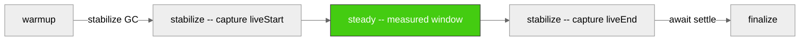
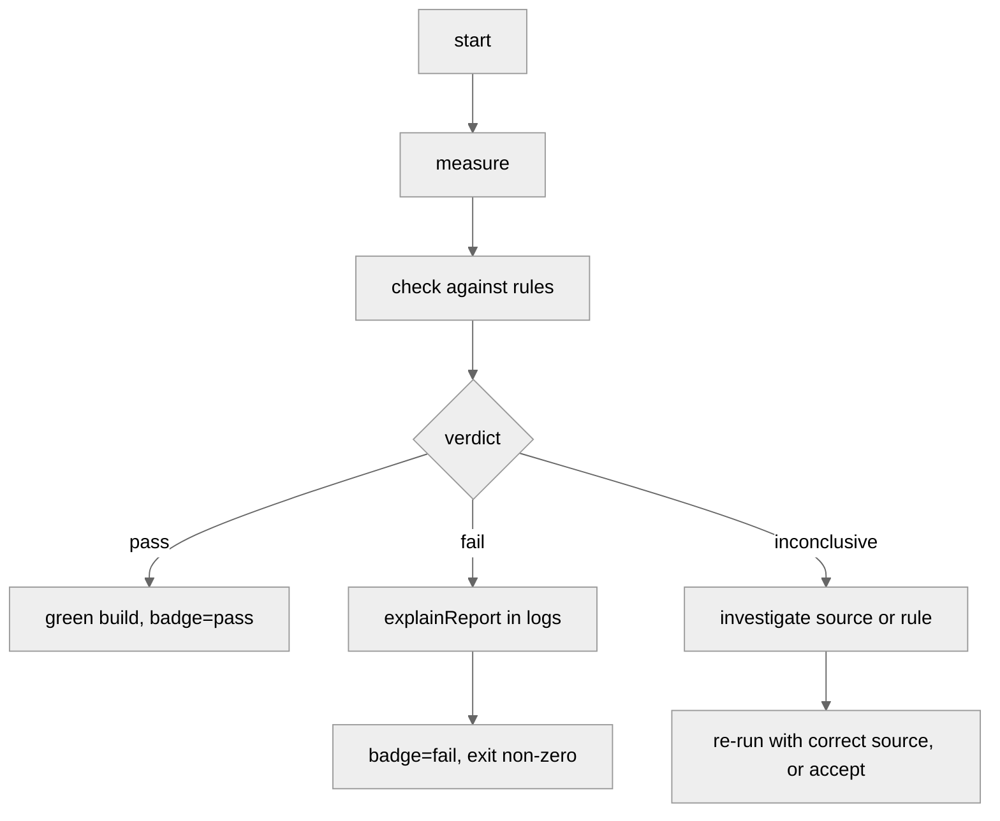

# Cookbook

The README is a reference. It answers *what does this API do?*

This is the cookbook. It answers *how do I use it for X?*

Recipes are graded -- five for people new to the library, three for
people who have shipped one gate and want to compare, baseline, and
narrate failures, two for real workloads across worker heaps and
allocator hunts. Read them in order if you are new; jump around if you
know what you are looking for.

Each recipe has the same shape:

- **Goal** -- what you are trying to prove.
- **Primitive** -- which entry point.
- **Code** -- the smallest correct usage.
- **Reading the verdict** -- what each field of the report actually
  means for your goal.
- **Gotchas** -- the traps I fell in first.

Everything below assumes you have run `npm i @zakkster/lite-gc-profiler`
and that your test process starts with `node --expose-gc`. If you have
not read the README, this cookbook will still work; you will get more
out of it if you have.

## Contents

**Diagrams**

- [The phase timeline](#the-phase-timeline)
- [The source verifiability matrix](#the-source-verifiability-matrix)
- [The CI workflow](#the-ci-workflow)

**Recipes**

1. [My first gate](#recipe-1-my-first-gate)
2. [Picking a lane](#recipe-2-picking-a-lane)
3. [Setting a threshold you can defend](#recipe-3-setting-a-threshold-you-can-defend)
4. [Reading a verdict correctly](#recipe-4-reading-a-verdict-correctly)
5. [Adding a gate to CI](#recipe-5-adding-a-gate-to-ci)
6. [Comparing against a control](#recipe-6-comparing-against-a-control)
7. [Baseline lock: capture once, gate forever](#recipe-7-baseline-lock-capture-once-gate-forever)
8. [Explaining a failure](#recipe-8-explaining-a-failure)
9. [Gating across worker threads](#recipe-9-gating-across-worker-threads)
10. [Explain mode: finding the allocator](#recipe-10-explain-mode-finding-the-allocator)

**CLI**

- [Running lite-gc-gate directly](#cli-running-lite-gc-gate-directly)
- [Handling inconclusive verdicts in CI](#cli-handling-inconclusive-verdicts-in-ci)

---

## Diagrams

### The phase timeline

A `stabilize:true` measurement is not one continuous window. It is four
phases with two forced-GC anchors between them. Warmup allocations do
not count against steady gates because the anchor sits between them.



`bytesPerOp = (liveEnd - liveStart) / ops`. The two forced GCs give you
the compacted live-set delta -- retention, not transient churn. On sync
`measureOps`, `stabilize:true` is opt-in. On `measureFrames` and
`measureOpsAsync`, it is on by default when `globalThis.gc` is available,
because those lanes are already async and the marginal cost of two GCs
at boundaries is negligible.

### The source verifiability matrix

Not every rule can be checked on every runtime. Node has precise GC
events via `perf_hooks`, Chrome has a heap-drop heuristic, cross-origin
isolated pages have `measureUserAgentSpecificMemory`, everywhere else
has frame anomalies. The matrix decides.

| rule | `gc` (Node) | `heap` (Chrome) | `uasm` (Chrome+coop) | `none` |
| --- | --- | --- | --- | --- |
| `maxBytesPerOp` | needsHeap | needsHeap | needsUasm | no |
| `maxBytesPerFrame` | needsHeap | needsHeap | needsUasm | no |
| `maxMajorsPerKOp` | yes | no | no | no |
| `maxMinorsPerKOp` | yes | no | no | no |
| `maxPauseMsPerOp` | yes | no | no | no |
| `maxDroppedFrames` | **yes** | **yes** | **yes** | **yes** |

`maxDroppedFrames` is the one row that works everywhere -- work-time is
measured directly from `performance.now()`, no memory channel required.
The rest gate on `inconclusive`, not `pass`, if the source can't verify.

### The CI workflow

Measurement is the middle of a longer flow. The failure path matters
more than the pass path.



The failure path leaves you evidence. Never bypass it with
`allowInconclusive` unless you know why the run can't verify.

---

## Recipe 1: My first gate

**Goal.** Prove that one call into my hot path retains under N bytes.

**Primitive.** `assertOps` with `stabilize: true`.

**Code.**

```js
import { assertOps } from '@zakkster/lite-gc-profiler';

function signalSet(i) {
    // your hot path
    mySignal.set(i);
}

assertOps(signalSet,
    { maxBytesPerOp: 5 },
    { ops: 10_000, warmup: 500, stabilize: true }
);
```

Run under `node --expose-gc`. If the hot path retains under 5 bytes per
call, the function returns a report. If it retains more, it throws
`GcBudgetError`. If the source cannot verify -- browser without a heap
channel, `source: 'none'` -- it throws `GcInconclusiveError`.

**Reading the verdict.** The successful report shape from sync `checkOps`:

```js
{
    kind: 'ops',
    verdict: 'pass',
    checked: { maxBytesPerOp: true },
    violations: [],
    ok: true,                                      // v1.0.0-shape convenience
    ops: 10000,
    opsPerSec: 15234000,
    bytesPerOp: 0.8,                               // your measured retention rate
    source: 'gc',
    summary: { /* GcSummary tree */ }
}
```

`bytesPerOp: 0.8` means the workload retained under one byte per call.
That is the number your CI should compare against next time.
`checked: { maxBytesPerOp: true }` means the rule actually enforced
something -- it did not silently skip because the source couldn't
observe.

The sync ops lane exposes only `bytesPerOp` as a rule. There is no
`bytesPerOpStable` field on this path -- the sync primitive does not
distinguish between the stabilised and raw two-point paths at the API
level. Use `measureOpsAsync` (Recipe 3) if you need that flag; that
lane returns `bytesPerOpStable` in the result and its `checkOpsAsync`
report wraps the measurement in `report.result`.

**Gotchas.**

- Without `--expose-gc`, `stabilize: true` throws at setup rather than
  silently downgrading. That is intended: if you asked for the
  stabilised path, you get it or an error, never a false pass on the
  noisier raw two-point delta.
- `ops: 10_000` is a reasonable default for a signal setter. A workload
  that takes a millisecond per op should use `ops: 100` and a longer
  wall-clock budget.
- `warmup: 500` matters. V8 does not tier-optimise your hot path on the
  first call; the first hundred iterations of the steady phase would
  otherwise be the JIT tiering up, not the workload you meant to
  measure.

---

## Recipe 2: Picking a lane

**Goal.** Know which primitive to reach for.

The library has four measurement lanes. They measure different things.
Pick the one whose *shape* matches your workload.

| your workload | primitive | schema |
| --- | --- | --- |
| synchronous hot path, tight loop | `measureOps` | `lite-gc-ops/1` |
| async hot path, awaits between calls | `measureOpsAsync` | `lite-gc-ops-async/1` |
| render loop, work per frame, frame budget | `measureFrames` | `lite-gc-frames/1` |
| whole-window observation, no per-op or per-frame accounting | `assertNoGc` / `checkNoGc` | `lite-gc-report/1` |

Rules of thumb:

- **Solid.js signals**, **Preact Signals sync path**, **any function
  that returns synchronously** -- `measureOps`.
- **Vue reactivity effects**, **Svelte 5 runes**, **Preact Signals
  batched effects**, **any function that awaits its own work** --
  `measureOpsAsync`.
- **Anything on a scheduler**: canvas render loops, DOM commit phases,
  particle systems, physics ticks -- `measureFrames`.
- **A whole request/response cycle**, **a fixture-driven simulation**,
  or **the "does anything major happen here at all" question** --
  `assertNoGc`.

The three per-op / per-frame lanes cover the "hot path" question at
different granularities. `assertNoGc` covers the "does this window
allocate anything measurable" question.

**Gotcha.** `measureOps` is *sync*. `PerformanceObserver` -- the
mechanism Node uses to hear GC events -- delivers on event-loop turns.
A sync loop never yields, so `result.summary.phases.steady.gc.major`
reads zero even under heavy churn. This is honest ("the observer saw
nothing"), not misleading ("the workload was clean"). The ops lane
exposes only `bytesPerOp` as a rule for exactly this reason -- memory
readings do not require an observer turn. If you need GC-event counts
under real churn, use `measureOpsAsync` (every `await` yields) or
`measureFrames` (the scheduler yields between frames).

---

## Recipe 3: Setting a threshold you can defend

**Goal.** Pick a `maxBytesPerOp` number that will not have to change
next month.

The wrong way is to guess `{ maxBytesPerOp: 10 }` because 10 sounds
tight. Ten what -- ten bytes of what, on which V8 build? Retained
object sizes vary. A plain object of 30 keys is ~1.7 KB on one V8
build, ~340 bytes on another (pointer compression, header layout,
V8 version). A threshold that passes CI on your laptop fails on the
runner. Not flaky. Wrong.

The right way is two lines:

```js
// 1) Measure the clean floor on THIS machine.
const clean = await measureOpsAsync(cleanFn, { ops: 10_000, warmup: 500 });
const floor = Math.max(clean.bytesPerOp, 32);        // guard against zero

// 2) Gate a candidate relative to the floor.
await assertOpsAsync(candidateFn,
    { maxBytesPerOp: floor * 4 },
    { ops: 10_000, warmup: 500 }
);
```

`floor * 4` is four times the noise floor you measured on this
machine. On a stabilised path (`stabilize: true` on the async lanes,
by default under `--expose-gc`) the clean floor is close to zero, and
a real leak reads its true rate. A 4x multiplier is comfortable
headroom against V8 build variance without being permissive.

For **portable test payloads** in torture-style pins, prefer
`new Array(1024).fill(i)` over plain objects. Fixed-size typed-array
slots are heap-visible with predictable size on every V8 build; plain
objects are not.

**Gotcha.** `compareOps` and `compareOpsAsync` delta rules under
`Promise.all` cannot be trusted -- as of v1.5.1 they now throw at
setup, because two measurements running concurrently silently
contaminate each other's readings on the shared heap. Use them
sequentially, which is what `compareOps` does internally anyway.

---

## Recipe 4: Reading a verdict correctly

**Goal.** Understand what each field of the report actually tells you.

There are three verdicts. All three are informative. None of them
means "definitely OK to ship."

**`pass`** -- the actual metric was under the limit AND the source
could verify the rule. `checked[rule] === true`. This is the only
verdict that lets a build stay green.

**`fail`** -- the metric was over the limit. `violations` contains
`{ rule, metric, actual, limit }` for each rule that failed. The
number that matters is not `actual` alone; it is `actual - limit` and
the ratio `actual / limit`. `explainReport` computes both.

**`inconclusive`** -- the source could not verify at least one rule.
`checked[rule] === false` for the rules that could not be checked.
This is a real answer, not a soft failure. It usually means:

- The runtime does not expose a heap channel (`source: 'none'`), so
  `maxBytesPerOp` cannot be enforced. Fix: run under Node or Chrome, or
  drop the rule.
- The measurement produced a non-finite metric (`NaN`, `Infinity`), so
  the comparison would silently pass everything. Fix: investigate the
  source, do not use `allowInconclusive`.
- Comparing across mixed sources in an aggregate. Fix: run all
  contexts on the same explicit source.

Two more fields matter for interpretation:

**`bytesPerOpStable`** (async ops) / **`bytesPerFrameStable`** (frames)
-- `true` means the stabilised live-set-delta path ran (retention, not
noise). `false` means the raw two-point delta ran (higher noise floor,
readings can be off by 1000 B/frame or more).

**`asyncResidual`** (async ops, frames) -- bytes the heap grew AFTER
`gc.settle()`. Non-zero means the workload spawned work that outlived
the measurement window -- a fire-and-forget microtask, a background
timer. Not a gate rule; a smoke signal. If you wrote a hot path that
expects to be synchronous, non-zero here means you missed an `await`.

`explainReport` narrates all of this. Recipe 8 shows it in use.

---

## Recipe 5: Adding a gate to CI

**Goal.** Fail my build on a retention regression.

The minimum GitHub Actions workflow:

```yaml
name: gc-gate
on: [push, pull_request]

jobs:
  gate:
    runs-on: ubuntu-latest
    steps:
      - uses: actions/checkout@v4
      - uses: actions/setup-node@v4
        with: { node-version: '20' }
      - run: npm ci
      - run: node --expose-gc test/gc-gate.mjs
```

The gate script (`test/gc-gate.mjs`):

```js
import { assertOps } from '@zakkster/lite-gc-profiler';
import { explainReport, gateBadge } from '@zakkster/lite-gc-profiler/explain';
import { writeFileSync } from 'node:fs';
import { hotPath } from '../src/index.js';

try {
    const report = assertOps(hotPath,
        { maxBytesPerOp: 5 },
        { ops: 10_000, warmup: 500, stabilize: true }
    );
    writeFileSync('gc-badge.json',
        gateBadge(report, { format: 'shields-json' }));
} catch (err) {
    console.error(explainReport(err.report, { colour: true }));
    if (err.report) {
        writeFileSync('gc-badge.json',
            gateBadge(err.report, { format: 'shields-json' }));
    }
    process.exit(1);
}
```

The badge JSON drives a live shields.io badge in your README:

```md

```

**Gotchas.**

- `--expose-gc` is required. Without it, `stabilize: true` throws and
  the gate never runs.
- Set `EXPECTED_VERSION` in your baseline test as well; a drift on the
  library version can silently change semantics.
- `process.exit(1)` runs after the catch block; do not put it inside
  `finally` unless you want to swallow the error.
- The badge JSON is written both on success (green) and on failure
  (red). Serve it from the same URL; a stale badge is worse than no
  badge.

---

## Recipe 6: Comparing against a control

**Goal.** Prove that my new implementation does not retain more than
the old one.

The wrong way is to gate the new implementation against a hard
`maxBytesPerOp` number. That number will drift with V8 versions and
with unrelated refactors. The right way is to compare the two
implementations against each other under identical conditions on the
same machine and gate the delta.

```js
import { assertCompareOpsAsync } from '@zakkster/lite-gc-profiler';
import { oldImpl, newImpl } from '../src/index.js';

await assertCompareOpsAsync(oldImpl, newImpl,
    { maxExtraBytesPerOp: 0 },                     // the new must not retain more
    { ops: 10_000, warmup: 500, stabilize: true }
);
```

`{ maxExtraBytesPerOp: 0 }` says: the new implementation may not
retain more bytes per op than the old one, at all. If it does, the
gate throws with a report that includes both `control.bytesPerOp` and
`candidate.bytesPerOp`, so the diff is obvious.

Softer thresholds are fine for exploratory work:
`{ maxExtraBytesPerOp: 8 }` allows the new implementation to retain up
to 8 extra bytes per op -- useful during a refactor where you want to
catch a doubling but not a marginal drift.

**Gotchas.**

- `stabilize: true` is required for a delta gate to be trustworthy.
  Without it, both readings sit on multi-KB/op cold-start noise; the
  delta is noise-of-noise, and a `maxExtraBytesPerOp: 1024` gate
  passes everything.
- Both functions must be *serialisable to the same measurement*. Old
  and new must be called with the same `i`, in the same environment,
  on the same warmup. `compareOps` does that; do not roll your own.
- The convenience form (two functions) runs them *sequentially* on the
  shared heap. Never parallel. Since v1.5.1, parallel runs throw at
  setup rather than silently contaminating each other.

---

## Recipe 7: Baseline lock: capture once, gate forever

**Goal.** Freeze a known-good distribution and gate every future run
against it.

Threshold gates guard absolute values. Baseline gates guard
distributions. Same idea as a golden-master test, adapted for
statistical readings.

Baseline gating is a **whole-window** concern -- it gates on the GC
summary a `GcProfiler` records over an entire measurement window, not
on a per-op or per-frame rate. Use this for the "is anything major
happening at all in this workload" question, not for "what's the
retention per signal setter."

**Step 1: capture the baseline** (once, on a known-good build).

```js
import { GcProfiler, aggregateGc, createBaseline, captureFingerprint } from '@zakkster/lite-gc-profiler';
import { writeFileSync } from 'node:fs';

// Run the workload N times, collect the summaries.
const summaries = [];
for (let i = 0; i < 5; i++) {
    const gc = new GcProfiler().start();
    await runHotPathWorkload();                    // your workload here
    await gc.settle();
    summaries.push(gc.summary());
    gc.stop();
}

const aggregate = aggregateGc(summaries);
const baseline = createBaseline(aggregate);
baseline.fingerprint = captureFingerprint();       // node version, arch, cpu

writeFileSync('gc-baseline.json', JSON.stringify(baseline, null, 2));
```

Commit `gc-baseline.json` to your repo. It records the distribution's
median, max, and jitter for each GC metric.

**Step 2: gate every future run.**

```js
import { GcProfiler, aggregateGc, assertAgainstBaseline } from '@zakkster/lite-gc-profiler';
import { readFileSync } from 'node:fs';

const baseline = JSON.parse(readFileSync('gc-baseline.json', 'utf8'));

const summaries = [];
for (let i = 0; i < 3; i++) {
    const gc = new GcProfiler().start();
    await runHotPathWorkload();
    await gc.settle();
    summaries.push(gc.summary());
    gc.stop();
}

assertAgainstBaseline(aggregateGc(summaries), baseline);
```

`assertAgainstBaseline` gates on the baseline's `max` per metric, not
its `median`. A run whose median is worse than the baseline's max
fails. A run that lands within the baseline's own historical spread
passes.

**The CLI shorthand.** The whole capture-then-gate flow is one command:

```
# capture on the good build
npx lite-gc-gate run test/gc-window.mjs --reps 5 --baseline gc-baseline.json --update-baseline

# every future run
npx lite-gc-gate run test/gc-window.mjs --reps 3 --baseline gc-baseline.json
```

Where `test/gc-window.mjs` is a target script that runs your workload
once (the CLI's `--reps` handles the repetition and aggregation).

**Gotchas.**

- **A baseline that cannot verify anything is `inconclusive`, not
  `pass`.** As of v1.5.2, a comparison counts only when both the
  current aggregate and the baseline have finite values for a metric.
  A truncated baseline (missing groups, schema drift) yields
  `inconclusive` with `reason: 'no_comparable_metrics'`. Regenerate
  the baseline rather than reaching for `allowInconclusive`.
- **Regenerate the baseline on major V8 changes.** A stale baseline is
  a soft green build. Move it deliberately, not accidentally.
- **Fingerprint mismatches** (different Node major, different CPU
  arch) yield `inconclusive` by default. Pass
  `--accept-fingerprint-mismatch` (CLI) or the equivalent option on
  the programmatic API only when you know the drift is legitimate.
- **The per-op / per-frame lanes do not have first-class baseline
  support** in this batch. For those, capture the clean floor on the
  known-good build, store it as a hard-coded threshold, and gate
  against it. Recipe 3.

---

## Recipe 8: Explaining a failure

**Goal.** Turn a `verdict: 'fail'` object into a CI log line a human
can act on.

The failure is not the report. The failure is what CI shows you.

```js
import { assertOpsAsync, GcBudgetError } from '@zakkster/lite-gc-profiler';
import { explainReport } from '@zakkster/lite-gc-profiler/explain';

try {
    await assertOpsAsync(hotPath,
        { maxBytesPerOp: 5 },
        { ops: 10_000, warmup: 500 });
} catch (err) {
    if (err instanceof GcBudgetError) {
        console.error(explainReport(err.report, { colour: true }));
    }
    throw err;
}
```

The output shape:

```
gc-gate: FAIL -- ops-async

Violations (1):
  maxBytesPerOp
    actual: 47.20
    limit:  5 (+42.20; +844.00% over limit)
    means:  bytes per op

Run:
  ops:     10000
  warmup:  500
  source:  gc
  stabilized: yes
```

`stabilized: yes` tells you the reading is trustworthy retention, not
cold-start noise. `+844.00% over limit` tells you the regression is
not a marginal 10% -- something is retaining an object per call. Time
to run explain mode (Recipe 10).

For a compare failure, the output includes both sides:

```
gc-gate: FAIL -- ops

Violations (1):
  maxExtraBytesPerOp [bytesPerOp.delta]
    actual: 42.20
    limit:  0 (+42.20; +Infinity% over limit)
    means:  extra bytes per op vs control

Comparison:
  bytesPerOp:    control=5.00  candidate=47.20
```

Reading the delta alone is unactionable -- you need to see the
absolute readings on both sides to know which side moved.

**Gotcha.** `explainReport` is a pure formatter. It reads reports and
emits strings. Safe to run in a signal handler, an exit hook, or a
browser. It does not measure, does not open observers, does not
perturb. But it also **cannot upgrade a `pass` to a `fail` based on a
stale `violations` array** -- the `verdict` field is the source of
truth. If you mutate a report by hand, mutate `verdict` too.

---

## Recipe 9: Gating across worker threads

**Goal.** Prove that my four-worker system does not retain more than 5
bytes per op *across all four heaps combined*.

Every measurement lane before this batch measures one shared heap in
one context. A workload distributed across N worker_threads is N
heaps, N observers. A main-thread gate misses everything the workers
retain.

```js
// worker.mjs
import { measureOps } from '@zakkster/lite-gc-profiler';
import { parentPort } from 'node:worker_threads';
import { hotPath } from '../src/index.js';

const result = measureOps(hotPath,
    { ops: 10_000, warmup: 500, stabilize: true });
parentPort.postMessage(result);
```

```js
// main.mjs
import { Worker } from 'node:worker_threads';
import { assertAggregateReport } from '@zakkster/lite-gc-profiler';

const workerUrl = new URL('./worker.mjs', import.meta.url);

function runOne() {
    return new Promise((res, rej) => {
        const w = new Worker(workerUrl);           // inherits --expose-gc
        w.once('message', (m) => { w.terminate(); res(m); });
        w.once('error', rej);
    });
}

const reports = await Promise.all([runOne(), runOne(), runOne(), runOne()]);
assertAggregateReport(reports, { maxBytesPerOp: 5 });
```

The aggregator weights by ops. `bytesPerOp` in the aggregate is
`total_bytes / total_ops` across all four workers, not a naive mean.
A 1-op worker with a huge rate cannot swamp a 1M-op worker with a
tiny rate.

**Reading the aggregate verdict.** The aggregate shape:

```js
{
    schema: 'lite-gc-ops-multi/1',
    kind: 'ops-multi',
    contexts: 4,
    aggregate: {
        source: 'gc',
        totalOps: 40000,
        bytesPerOp: 3.2,
        bytesPerOpStable: true,             // AND across contexts
        majorsPerKOp: 0.1,
        minorsPerKOp: 2.4,
        maxPauseMsPerOp: 3.8                 // MAX across contexts
    },
    perContext: [ /* input reports, defensive copy */ ]
}
```

`bytesPerOpStable: true` here means every one of the four workers ran
the stabilised path. If any single worker's flag were `false`, the
aggregate flag would be `false` -- a gate cannot be more trustworthy
than its least-trustworthy source.

**Gotchas.**

- **Do not pass `--expose-gc` via `execArgv`**. Node rejects it with
  `ERR_WORKER_INVALID_EXEC_ARGV`. Workers inherit the parent's V8
  flags; if your test script sets `--expose-gc`, the worker gets it.
- **Mixed sources yield `inconclusive`** with `reason:
  'source_mismatch'`. If one worker runs under `--expose-gc` and
  another does not, the aggregate cannot be gated. Rerun everything on
  the same source.
- **No `measureOpsAcrossWorkers` convenience form**. The
  worker-spawning API differs between Node (`worker_threads`) and
  browser (`new Worker(URL.createObjectURL(new Blob(...)))`), and a
  portable wrapper cannot faithfully own both. You bring the workers;
  the aggregator handles the semantic. On the browser side,
  `@zakkster/lite-worker` is the recommended transport -- its
  `frameChannel` pairs cleanly with `measureFrames`.

---

## Recipe 10: Explain mode: finding the allocator

**Goal.** A gate has failed. I know *what* retained too much, but not
*where* the allocation happened.

Region attribution answers "where did the pause fire." Explain mode
answers "which allocation stacks caused the pressure."

**STRICT OPT-IN.** Never active during a gated run. The sampler
perturbs the very thing measurement is trying to capture; running it
inside a gate would corrupt every zero-major claim in the same window.

```js
import { startExplainSampling, formatExplainConsole } from '@zakkster/lite-gc-profiler/explain';

const handle = startExplainSampling({
    intervalBytes: 512 * 1024,                     // 512 KB between samples
    topN: 10
});
await handle.started;

// Run the workload that was failing.
for (let i = 0; i < 10_000; i++) hotPath(i);

const result = await handle.stop();
process.stdout.write(formatExplainConsole(result) + '\n');
```

Output:

```
Top allocation stacks (interval=524288 bytes):
  allocateBucket         256.0 KB   file:///project/src/pool.js:42
  parseChunk             128.0 KB   file:///project/src/parse.js:17
  copyOnWrite             64.0 KB   file:///project/src/cow.js:81
  ...
```

The names on the left are the allocator sites. The paths on the right
are the exact source lines. That is where to look first.

**Gotchas.**

- **Node-only.** Browsers do not expose the inspector protocol; explain
  mode has no browser counterpart. For browser workloads, use the
  DevTools Memory panel manually.
- **Smaller `intervalBytes` means more detail *and* more perturbation.**
  512 KB is the default because it captures the top ten hot allocators
  without changing the measurement enough to matter. Do not go below
  64 KB unless you are prepared for the sampler to show up in the
  results as the largest allocator.
- **Explain mode answers "who allocated," not "where the pause fired."**
  Region attribution (Recipe not yet written; see README) is
  firing-site. Both are useful. Neither substitutes for the other.

---

## CLI: Running lite-gc-gate directly

**Goal.** Run a gate from the shell without writing a wrapper script.

The library ships a small CLI, `lite-gc-gate`, that runs a target Node
script as a subprocess and gates against its measurement output.
Useful for CI hosts where a `node` invocation is the only thing
available.

The shape:

```
lite-gc-gate run <script> [options]
```

`<script>` is a *target Node script* that runs your workload -- your
own hot-path harness. The CLI spawns it under `--expose-gc` (via
`spawnSync`), collects the measurement output, gates it against the
rules from `--config`, and exits with a code that CI can read.

**Rules config** (`gate.config.json`):

```json
{
    "rules": {
        "maxBytesPerOp": 5,
        "maxMajorsPerKOp": 0
    }
}
```

**Target script** (`test/hot-path-harness.mjs`):

```js
import { measureOps } from '@zakkster/lite-gc-profiler';
import { hotPath } from '../src/index.js';

const result = measureOps(hotPath,
    { ops: 10_000, warmup: 500, stabilize: true });
process.stdout.write(JSON.stringify(result));
```

**Invocation.** Install the package (as a dev dependency), then:

```
npx lite-gc-gate run test/hot-path-harness.mjs --config gate.config.json
```

Or without an install (one-shot):

```
npx @zakkster/lite-gc-profiler lite-gc-gate run test/hot-path-harness.mjs --config gate.config.json
```

Useful flags:

- `--reps N` -- run the target N times and gate on the aggregate. Uses
  the rep-aware gating that guards distributions, not point readings.
- `--baseline path` -- check against a baseline JSON file. Same
  semantic as Recipe 7's `assertAgainstBaseline`, at the shell.
- `--update-baseline` -- write the current aggregate as a new baseline
  at `--baseline` path. Rerun this whenever you have a legitimate
  reason to move the floor.
- `--format console | json | markdown | github` -- how to render the
  verdict. `github` emits GitHub Actions annotation lines.
- `--allow-inconclusive` -- see the next recipe.

**Reading the exit code:**

- `0` -- the gate passed. Ship.
- `1` -- the gate failed on `fail`, or on `inconclusive` if you did
  not pass `--allow-inconclusive`. The log has the verdict output.
  See Recipes 4 and 8.
- `2` -- inconclusive, only reachable with `--allow-inconclusive`. See
  the next recipe.
- `3` -- infrastructure error. The target script crashed, the config
  was invalid, the fingerprint didn't match. Not a gate signal;
  something in the harness is broken.

## CLI: Handling inconclusive verdicts in CI

**Goal.** Distinguish a real failure (exit 1) from a runtime the
source cannot observe on (exit 2).

Some CI hosts do not run under `--expose-gc` by default and cannot be
made to. Some workloads run on `source: 'none'` and cannot be gated
on `maxBytesPerOp`. The honest answer in those cases is
`inconclusive`.

By default `lite-gc-gate` treats `inconclusive` as `fail` -- exit
code `1`. That is intentional: a source that cannot verify is not the
same as a workload that passed, and CI should notice.

For hosts where inconclusive should not fail the build (a weekend
nightly, a preview branch), `--allow-inconclusive` maps inconclusive
to exit code `2`:

```yaml
# GitHub Actions
- name: gc gate
  id: gate
  continue-on-error: true
  run: >
    npx lite-gc-gate run test/hot-path-harness.mjs
    --config gate.config.json
    --allow-inconclusive

- name: interpret verdict
  run: |
    code=${{ steps.gate.outputs.exitCode }}
    case "$code" in
      0) echo "gc gate: pass" ;;
      1) echo "::error::gc gate failed"; exit 1 ;;
      2) echo "::warning::gc gate inconclusive -- investigate source" ;;
      3) echo "::error::gc gate infrastructure error"; exit 1 ;;
    esac
```

Do not use `--allow-inconclusive` as the default. It converts a real
signal ("something in the runtime prevented verification") into a soft
warning. Use it only when you have investigated *why* the source could
not verify and decided that the specific run is out of scope for that
gate.

---

Everything above assumes the library is doing its job -- three-state
verdicts, forced-boundary anchoring, ops-weighted aggregation, no
observer perturbation on the formatter side. If you find a case where
the gate silently passes on a workload that a debugger and a
memory panel show is leaking, that is the failure mode I care about
most. File it as an adversarial torture case; the ledger is real.
